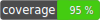

# Laravel Discord Bot
A robust Discord messaging integration for Laravel



[](https://packagist.org/packages/nwilging/laravel-discord-bot)
[](https://packagist.org/packages/nwilging/laravel-discord-bot)
[](https://packagist.org/packages/nwilging/laravel-discord-bot)

---
### About

This package provides a notification channel to send messages to Discord, as well as a suite of tools, services,
and components that will help you to build rich-text messages as well as handle
[Discord Interactions](https://discord.com/developers/docs/interactions/receiving-and-responding).

---

# Installation

### Pre Requisites
1. Laravel v8+
2. PHP 7.4+
3. [libsodium](https://doc.libsodium.org/bindings_for_other_languages#programming-languages-whose-standard-library-includes-support-for-libsodium)

### Install with Composer
```
composer require nwilging/laravel-discord-bot
```

### Configuration

1. Visit the [Discord Developer Portal](https://discord.com/developers/applications) and create a new Application
2. Copy the Application ID and the Public Key
3. Create a Bot User
4. Reset the Bot User Token and copy it

Populate your `.env`:
```
DISCORD_API_BOT_TOKEN=<bot user token from above>
DISCORD_APPLICATION_ID=<application id from above>
DISCORD_PUBLIC_KEY=<public key from above>
```

#### Additional Configuration (optional)

When handling interactions the default response behavior is to "defer" - aka stop the loading process in the Discord
app window and return no reply or other message. If you'd like to change this to "load" - which will show a loading
message until your application sends a followup message - add the following to your `.env`:
```
DISCORD_COMPONENT_INTERACTION_DEFAULT_BEHAVIOR=load
```

# Notification Channel Usage

Your notification class must implement the interface 
`Nwilging\LaravelDiscordBot\Contracts\Notifications\DiscordNotificationContract`, and include the `toDiscord(): array`
method.

#### Example with Plain Text message
```phpt
<?php

namespace App\Notifications;

use Illuminate\Bus\Queueable;
use Illuminate\Notifications\Notification;
use Nwilging\LaravelDiscordBot\Contracts\Notifications\DiscordNotificationContract;
use Nwilging\LaravelDiscordBot\Support\Builder\ComponentBuilder;
use Nwilging\LaravelDiscordBot\Support\Builder\EmbedBuilder;

class TestNotification extends Notification implements DiscordNotificationContract
{
    use Queueable;

    public function via($notifiable)
    {
        return ['discord'];
    }

    public function toDiscord($notifiable): array
    {
        return [
            'contentType' => 'plain',
            'channelId' => 'channel ID',
            'message' => 'message content',
        ];
    }
}
```

#### Example with Rich Text message
```phpt
<?php

namespace App\Notifications;

use Illuminate\Bus\Queueable;
use Illuminate\Notifications\Notification;
use Nwilging\LaravelDiscordBot\Contracts\Notifications\DiscordNotificationContract;
use Nwilging\LaravelDiscordBot\Support\Builder\ComponentBuilder;
use Nwilging\LaravelDiscordBot\Support\Builder\EmbedBuilder;

class TestNotification extends Notification implements DiscordNotificationContract
{
    use Queueable;

    public function via($notifiable)
    {
        return ['discord'];
    }

    public function toDiscord($notifiable): array
    {
        $embedBuilder = new EmbedBuilder();
        $embedBuilder->addAuthor('Me!');

        $componentBuilder = new ComponentBuilder();
        $componentBuilder->addActionButton('My Button', 'customId');

        return [
            'contentType' => 'rich',
            'channelId' => 'channel id',
            'embeds' => $embedBuilder->getEmbeds(),
            'components' => [
                $componentBuilder->getActionRow(),
            ],
        ];
    }
}
```

### How to get a `channelId`

[How to find Discord IDs](https://www.remote.tools/remote-work/how-to-find-discord-id#how-to)

You must specify the actual ID of the channel when sending messages to the Discord API. This can be done directly in
the Discord client application by enabling developer tools.

---

# Interactions Usage

If you are sending messages that have components such as buttons, inputs, menus, etc, Discord will be prepared
to send user interactions with these components as requests to a specified endpoint - essentially a webhook - with the
interaction event payload.

### Setting up interactions

First setup a controller and/or route that you plan to use as the callback URL for interactions. Within the controller
for this route, inject the `Nwilging\LaravelDiscordBot\Contracts\Services\DiscordInteractionServiceInterface`.

You will call the `handleInteractionRequest` method on the aforementioned service. Example:

```phpt
use Nwilging\LaravelDiscordBot\Contracts\Services\DiscordInteractionServiceContract;

class MyController extends Controller
{
    private $interactionService;

    public function __construct(DiscordInteractionServiceContract $interactionService)
    {
        $this->interactionService = $interactionService;
    }
    
    public function handleDiscordInteraction(Request $request)
    {
        $response = $this->interactionService->handleInteractionRequest($request);
        return response()->json($response->toArray(), $response->getStatus());
    }
}
```
This will forward interactions requests from Discord through your app. **You must forward requests through this
interaction service:** Discord requires signature verification, which this package performs automatically on every
interactions request. Attempting to handle requests outside of this package is possible, but not recommended.

### Listening for Interaction Events

When a user interacts with a component in your message - such as a button - this interaction is sent to your application.
This package will handle that interaction request and will dispatch an event when a new message component interaction
payload comes in.

This event is `Nwilging\LaravelDiscordBot\Events\MessageComponentInteractionEvent`, which contains a method `getInteractionRequest`,
which will return the `ParameterBag` from the original request object. You may call `->all()` on this to retrieve the array
representation of the interaction payload.

Your listeners _should_ implement `ShouldQueue` to prevent long-running synchronous processes from timing out the Discord
interaction request and presenting an error to the user. You may use synchronous listeners, but be aware that if an
error occurs during processing, the user will likely see a `This interaction failed` error message in Discord.

### Extending the message component interaction handler

The `MessageComponentInteractionHandler` does not support extending its functionality directly. However, it does support
the ability for your application to override the immediate response that is sent to Discord upon handling an interaction.

This is useful if you'd like to send a reply message when an interaction takes place or if you'd like to alter the default
behavior of _message component interactions_ specifically.

The `MessageComponentInteractionHandler` will check for any listeners in your application implementing the contract
`Nwilging\LaravelDiscordBot\Contracts\Listeners\MessageComponentInteractionEventListenerContract`. To override the
default response, your listener **must** implement this interface.

```phpt
use Illuminate\Contracts\Queue\ShouldQueue;
use Nwilging\LaravelDiscordBot\Events\MessageComponentInteractionEvent;
use Nwilging\LaravelDiscordBot\Contracts\Listeners\MessageComponentInteractionEventListenerContract;

class MessageComponentInteractionListener implements MessageComponentInteractionEventListenerContract, ShouldQueue
{
    public function replyContent(MessageComponentInteractionEvent $event): ?string
    {
        // return null; - to override and send no reply
        return 'my reply message';
    }
    
    public function behavior(MessageComponentInteractionEvent $event): int
    {
        // return static::LOAD_WHILE_HANDLING; // Shows a loading message/status while handling
        // return static::REPLY_TO_MESSAGE; // Replies to the interaction with replyContent(). Required if you want to reply to the interaction
        return static::DEFER_WHILE_HANDLING; // Shows no loading message/status while handling
    }

    public function handle(MessageComponentInteractionEvent $event): void
    {
        // Handle the event like a normal listener
    }
}
```

Since this is a listener, you do need to implement the `handle` method. It is recommended to combine this type of
functionality with a listener you plan to use to handle the actual message component interaction event.
